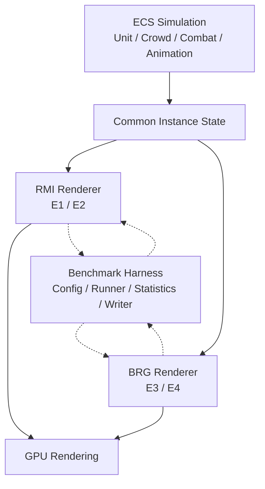
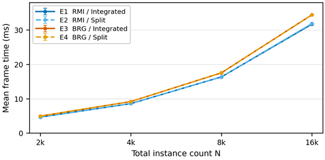
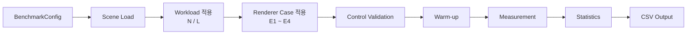

# Unity ECS 기반 대규모 3D 인스턴스 렌더링 성능 분석 및 최적화

Unity ECS 기반의 동일한 동적 시뮬레이션 환경에서 `Graphics.RenderMeshIndirect`(RMI)와 `BatchRendererGroup`(BRG)의 렌더링 경로 및 제출 구조에 따른 성능 특성을 정량적으로 분석한 프로젝트입니다.

---

### 1. 프로젝트 배경

#### 1.1. 국내외 시장 현황 및 문제점

실시간 게임과 시뮬레이션에서는 다수의 객체가 서로 다른 위치, 애니메이션 및 행동 상태를 유지하면서 동시에 가시화되는 대규모 동적 장면이 활용됩니다. 객체 수가 증가하면 기하 처리량뿐 아니라 상태 갱신, GPU 인스턴스 데이터 구성·전송, 렌더링 명령 제출 비용도 함께 증가하므로, 전체 처리 경로를 고려한 성능 분석이 필요합니다.

Unity는 대규모 인스턴스 렌더링을 위한 저수준 경로로 `Graphics.RenderMeshIndirect`(RMI)와 `BatchRendererGroup`(BRG)을 제공합니다. 두 경로는 인스턴스 데이터와 렌더링 명령을 구성·제출하는 방식이 다르며, 동일한 인스턴스 집합도 통합 또는 분할하여 제출할 수 있습니다.

그러나 동일한 Unity ECS 기반 동적 상태와 동등한 렌더링 조건에서 RMI와 BRG를 비교하고, 통합·분할 제출 구조의 영향을 함께 분석한 공개 정량 자료는 제한적입니다. 이러한 정보 공백이 본 프로젝트의 연구 문제이자 주제 선정의 출발점입니다.

#### 1.2. 필요성과 기대효과

대규모 동적 장면의 성능은 객체 수뿐 아니라 시뮬레이션, GPU 데이터 구성 및 렌더링 제출 구조의 영향을 함께 받습니다. 따라서 특정 API에 대한 일반적인 선호보다 실제 부하 조건에서의 반복 측정을 통해 렌더링 경로와 제출 구조를 판단할 수 있는 정량적 근거가 필요합니다. 본 프로젝트는 이러한 판단과 최적화 우선순위 설정에 활용할 수 있는 실증 자료를 제공하고자 합니다.

---

### 2. 개발 목표

#### 2.1. 목표 및 세부 내용

Unity ECS에서 생성한 동일한 동적 상태를 RMI와 BRG에 전달하고, 각 경로에 **통합 제출(Integrated)** 과 **4분할 제출(Four-way Split)** 을 교차 적용하는 2×2 실험 환경을 구성했습니다.

| Case | 렌더링 경로 | 제출 구조 |
|---|---|---|
| E1 | RenderMeshIndirect | Integrated |
| E2 | RenderMeshIndirect | Four-way Split |
| E3 | BatchRendererGroup | Integrated |
| E4 | BatchRendererGroup | Four-way Split |

모든 조건은 동일한 ECS 시뮬레이션, 메시·머티리얼, GPU 스키닝, 카메라 및 그래픽 설정을 공유하며 비교 요인인 렌더링 경로와 제출 구조만 변경합니다. 실험 워크로드는 총 인스턴스 수 `N = 2,000 / 4,000 / 8,000 / 16,000`과 스웜 수 `L = 4 / 8 / 16`의 조합으로 구성했습니다.

#### 2.2. 기존 서비스 대비 차별성

본 프로젝트는 서로 다른 기능이나 시뮬레이션 부하를 가진 구현을 비교하지 않고, **동일한 ECS 시뮬레이션 결과를 두 렌더링 경로의 공통 입력으로 사용**합니다. 또한 렌더링 backend와 submission granularity를 독립적인 요인으로 분리하여 비교 대상 이외의 조건 차이를 최소화했습니다.

벤치마크 실행 전에는 두 렌더링 경로의 메시, GPU 스키닝, 렌더 상태 및 제출 조건이 동일한지 자동 검증하며, 통제 조건이 일치하지 않으면 측정을 진행하지 않도록 구성했습니다.

#### 2.3. 사회적 가치 도입 계획

구현 코드와 반복 가능한 벤치마크 구조를 공개하여 Unity ECS 기반 대규모 렌더링 시스템의 성능 특성을 재현·검토할 수 있도록 합니다. 이를 통해 유사 시스템을 개발하거나 관련 기술을 학습하는 개발자가 측정 자료를 바탕으로 기술을 선택할 수 있는 참고 자료를 제공하고자 합니다.

---

### 3. 시스템 설계

#### 3.1. 시스템 구성도

시스템은 **ECS Simulation**, **Render Backends**, **Benchmark Harness**의 세 계층으로 구성됩니다. ECS 시뮬레이션이 공통 인스턴스 상태를 생성하면 RMI와 BRG가 이를 각 경로의 렌더링 데이터로 변환해 GPU에 제출합니다. Benchmark Harness는 실험 Case를 제어하고 통제 조건을 검증하며 렌더러의 계측값을 수집합니다.



실선은 렌더링 데이터 흐름, 점선은 Benchmark Harness의 Case 제어·조건 검증 및 Renderer Instrumentation 수집을 나타냅니다. 렌더링 경로는 시뮬레이션 상태를 읽기만 하며 ECS 시뮬레이션 결과에는 영향을 주지 않습니다.

#### 3.2. 사용 기술

| 기술 | 프로젝트 내 역할 |
|---|---|
| Unity `6000.3.9f1` | 프로젝트 실행 및 실험 환경 |
| Unity Entities `1.4.4` / Job System / Burst | ECS 상태 처리 및 병렬 시뮬레이션 |
| URP `17.3.0` | 렌더링 파이프라인 |
| `Graphics.RenderMeshIndirect` | E1/E2 렌더링 경로 |
| `BatchRendererGroup` | E3/E4 렌더링 경로 |
| Compute Shader / GPU Skinning | 인스턴스 변환 및 애니메이션 처리 |
| Frame Timing Manager | Main / Render / GPU 시간 측정 |

---

### 4. 개발 결과

`N = 2,000~16,000`, `L = 4·8·16`의 12개 워크로드에 네 렌더링 Case를 적용하고 각 조건을 5회 반복하여 총 **240회**를 측정했습니다. 각 실행은 3초 warm-up 후 60초 동안 진행했습니다. `L = 16`의 Integrated 조건에서 BRG의 평균 프레임 처리 시간은 RMI보다 **6.3~8.5% 높게 관측**되었으며, 동일 경로에서 Integrated와 Four-way Split의 차이는 **0.5% 이내**였습니다. 시뮬레이션 부하가 지배하는 조건에서는 렌더링 경로와 제출 구조에 따른 차이가 상대적으로 작아졌습니다.

<p align="center">
  
</p>
<p align="center"><sub>렌더링 경로 및 제출 구조별 평균 프레임 처리 시간 (L = 16)</sub></p>

따라서 결과는 특정 렌더링 경로의 일반적인 우위보다 **부하 특성에 따른 성능 차이**를 중심으로 해석해야 합니다.

#### 4.1. 전체 시스템 흐름도

`BenchmarkRunner`는 설정된 워크로드와 렌더링 Case를 독립적으로 실행하며, 측정 데이터를 메모리에 보관한 뒤 실행 종료 후 결과 파일로 기록합니다.



프레임 wall-time은 매 프레임 수집하고, 단계별 시간과 렌더러 구조 지표는 주기적으로 수집하여 실행별·조건별 통계를 생성합니다.

#### 4.2. 기능 설명 및 주요 기능 명세서

| 기능 | 입력 | 주요 처리 | 출력 |
|---|---|---|---|
| **ECS Simulation** | Unit 설정, 이동 명령, 탐지·전투 상태 | `LegionBase → Unit → Soldier` 계층에서 이동, 대열, 병사 위치·전투·애니메이션 상태 갱신 | 공통 ECS 인스턴스 상태 |
| **RMI Rendering** | 공통 ECS 상태, Mesh/Material, GPU Skinning 데이터 | GPU 인스턴스 데이터와 indirect command를 구성하고 Integrated/Split 구조로 `RenderMeshIndirect` 제출 | 렌더링 결과 및 RMI 구조 지표 |
| **BRG Rendering** | 공통 ECS 상태, Mesh/Material, GPU Skinning 데이터 | BRG instance buffer와 draw command를 구성하고 Integrated/Split 구조로 제출 | 렌더링 결과 및 BRG 구조 지표 |
| **Benchmark & Instrumentation** | Case, `N`, `L`, warm-up, 측정 시간, 반복 횟수 | 렌더러 전환, 통제 조건 검증, Frame/Thread/GPU/Renderer 지표 수집 및 통계 처리 | CSV / JSON 실험 결과 |

#### 4.3. 디렉토리 구조

```text
.
├── Assets/
│   ├── Benchmark/                       # 자동 벤치마크 및 결과 기록
│   ├── Scripts/
│   │   ├── Common/
│   │   ├── LegionBase/                  # 진영/스웜 생성 및 배치
│   │   └── Unit/
│   │       ├── Detection/               # 적 탐지 관련 ECS 로직
│   │       ├── Swarm/                   # Unit/Crowd/Animation ECS 시스템
│   │       │   └── ECS System/
│   │       └── Render/                  # RMI / BRG 렌더러 및 계측
│   ├── Shader/
│   │   └── Swarm/                       # Compute Shader 및 렌더링 셰이더
│   └── Scenes/                          # 실험 및 기능 검증 씬
├── Packages/                            # Unity package dependencies
├── ProjectSettings/                     # Unity 프로젝트 설정
├── bench data/                          # 벤치마크 결과 데이터
├── docs/                                # 보고서·발표자료·README 이미지
└── README.md
```

#### 4.4. 산업체 멘토링 의견 및 반영 사항

산업체 자문을 통해 렌더링 경로별 계측 지표의 처리 계층과 해석 범위를 재검토했습니다. 이를 바탕으로 최종 측정 및 분석에서는 논리적 제출 명령, 엔진 관측 Draw/Batch, 단계별 시간 지표를 구분하여 해석했습니다.

| 자문 의견 | 반영 사항 |
|---|---|
| Logical Submitted Commands와 Unity가 관측한 Draw/Batch는 서로 다른 처리 계층의 값이므로 구분하여 해석할 필요가 있음 | 논리적 제출 명령과 엔진 관측 Draw/Batch를 별도 지표로 계측하고, RMI와 BRG의 명령 수 절대값을 직접 대응시키지 않도록 분석 방법을 명확히 함 |
| Main / Render / GPU time은 특정 렌더러만의 순수 비용으로 볼 수 없음 | 각 값을 전체 workload에서 단계별 처리 부담과 병목 특성을 확인하는 보조 지표로 제한하여 해석함 |

---

### 5. 설치 및 실행 방법

#### 5.1. 설치절차 및 실행 방법

본 프로젝트는 **Unity `6000.3.9f1`** 환경에서 실행할 수 있습니다.

1. 저장소를 clone한 뒤 Unity Hub에서 프로젝트를 엽니다.

2. Unity 상단 메뉴에서 `Tools > Swarm Benchmark`를 선택하여 벤치마크 설정 창을 엽니다.

3. `Swarm Benchmark` 창에서 측정 조건을 설정합니다.
   - **측정 대상 씬**: `Assets/Scenes/Test/Test_Scene.unity` (`Test_Scene`) 지정
   - **실행 파라미터**: 측정 시간, 반복 횟수, warm-up, VSync 및 frame rate 설정
   - **렌더 Case**: RMI/BRG × Integrated/Four-way Split 중 측정할 Case 선택
   - **워크로드 (N×L)**: 총 인스턴스 수 `N`과 스웜 수 `L` 설정
   - **출력**: 벤치마크 결과를 저장할 폴더와 CSV/Renderer Instrumentation 옵션 설정

4. 설정이 완료되면 다음 실행 방법 중 하나를 선택합니다.
   - `Play 모드에서 실행`: Unity Editor의 Play Mode에서 벤치마크 수행
   - `개발 빌드 후 실행 (Standalone)`: Standalone Development Build를 생성한 뒤 벤치마크 수행

5. 측정이 완료되면 지정한 출력 폴더에서 벤치마크 결과 데이터를 확인할 수 있습니다.

본 연구의 실험 조건을 재현하려면 `논문(1.610) 프리셋 적용` 버튼을 사용할 수 있습니다. 이 프리셋은 `Test_Scene`을 측정 대상으로 지정하고, E1~E4 전체 Case와 `N = 2,000 / 4,000 / 8,000 / 16,000`, `L = 4 / 8 / 16`, 3초 warm-up, 60초 측정, 5회 반복 조건을 자동으로 설정합니다.

#### 5.2. 오류 발생 시 해결 방법

**설정한 벤치마크 파라미터가 적용되지 않는 경우**

Play Mode에 진입했지만 설정한 렌더 Case, 총 인스턴스 수 `N`, 스웜 수 `L` 등의 파라미터대로 실행되지 않는 경우 다음 항목을 확인합니다.

먼저 `Swarm Benchmark`의 **측정 대상 씬이 `Test_Scene`으로 지정되어 있는지** 확인합니다. 본 프로젝트의 자동 벤치마크는 `Assets/Scenes/Test/Test_Scene.unity`를 기준으로 구성되어 있으므로 다른 씬이 지정된 경우 의도한 실험 조건으로 실행되지 않을 수 있습니다.

또한 **출력 폴더 경로**가 현재 PC에서 유효하고 생성·쓰기 가능한 위치인지 확인합니다. 다른 PC에서 저장된 절대경로나 존재하지 않는 드라이브·사용자 경로가 남아 있으면 벤치마크 초기화가 정상적으로 진행되지 않아 설정한 실험 조건이 적용되지 않을 수 있습니다.

문제가 발생하면 출력 폴더 경로를 비우거나 현재 PC에서 접근 가능한 위치로 다시 지정한 뒤 벤치마크를 실행합니다.
---

### 6. 소개 자료 및 시연 영상

#### 6.1. 프로젝트 소개 자료

- [최종보고서](<docs/01.보고서/2026전기_최종보고서_15_미오_Unity ECS 기반 대규모 3D 인스턴스 렌더링 성능 분석 및 최적화.pdf>)

- [발표자료](docs/03.발표자료/2026발표자료_15_미오.pdf)

- [게재 논문: Unity ECS 대규모 인스턴스 렌더링의 간접 드로우와 엔진 관리 배치 제출 성능 비교](https://doi.org/10.9717/kmms.2026.29.8.1220)

#### 6.2. 시연 영상

[](https://youtu.be/g3IfH8IyHCw)

---

### 7. 팀 구성

#### 7.1. 팀원별 소개 및 역할 분담

**김재식**

ECS 기반 논리 유닛과 인스턴스 버퍼의 데이터 모델 및 상태 갱신 구조를 설계·구현하고, 시뮬레이션 데이터를 GPU 렌더링으로 연결하는 BRG 렌더러와 데이터 지향 인스턴싱 셰이더를 구현했습니다. 비교 실험을 위해 RMI 렌더링 경로와 Integrated/Four-way Split 제출 구조를 구성하고 기존 렌더링 구조를 보완했으며, 관련 연구 조사와 실험 설계, 논문 작성 및 프로젝트 총괄을 담당했습니다.

**이천서**

GPU 스키닝 기반 휴머노이드 애니메이션의 상태 입력과 위상 분산을 구현하고, 원거리 유닛·투사체·팩션 색상 등 유닛 구성과 스웜 스폰 및 베이스 자동화를 담당했습니다. 다수의 인스턴스가 동작하는 환경에서 애니메이션과 상태 전환의 일관성을 검증했으며, 최종 실험에서 수집된 데이터를 분석하여 조건별 성능 차이와 변화 경향을 정리했습니다.

**안지홍**

성능 지표를 자동으로 수집하는 벤치마크 도구와 CSV 결과 저장 및 빌드 자동화 기능을 구현하고, 휴머노이드 프리팹·3D 에셋과 GPU 스키닝 렌더링의 연결을 담당했습니다. 최종 비교 조건에 대한 반복 벤치마크를 수행하여 성능 데이터를 수집하고, 결과 데이터의 분석과 시각화를 통해 렌더링 경로와 제출 구조에 따른 성능 차이를 정리했습니다.


#### 7.2. 팀원 별 참여 후기

**김재식**

Unity ECS를 공부하고 프로젝트에 적용하는 과정에서 대규모 객체 처리와 렌더링 성능에 관심을 갖게 되었고, 관련 정량 자료의 공백을 확인하면서 이번 연구 주제를 정하게 되었습니다. 구현과 실험을 통해 스웜 내부의 병사 수가 증가할수록 상호작용 비용이 빠르게 커지고, 특정 조건에서는 ECS 시뮬레이션 자체가 주요 병목이 될 수 있음을 확인했습니다. 이를 통해 개별 기술의 최적화뿐 아니라 시스템 전체의 연산 부하를 고려한 데이터와 알고리즘 설계가 중요하다는 점을 경험했습니다.

**이천서**

처음에는 많은 인스턴스를 안정적으로 표현하는 데 집중했지만, 프로젝트를 진행하면서 동일한 조건을 구성하고 반복 측정하는 과정이 성능 분석에서 중요하다는 점을 배웠습니다. 스폰·애니메이션 기능을 렌더링 및 벤치마크 시스템과 통합하고, 병합 과정에서 발생한 충돌을 팀원들과 함께 해결했습니다. 또한 인스턴스 겹침과 이동 좌표, 애니메이션 시점, 팩션 색상 등을 조정하면서 대규모 장면에서는 성능뿐 아니라 여러 시스템이 일관되게 동작하도록 구성하는 과정도 중요하다는 것을 경험했습니다.

**안지홍**

Unity Profiler 사용 경험은 있었지만 성능 지표를 자동으로 수집하는 작업은 처음이어서, 자료를 찾아 `ProfilerRecorder`와 `FrameTimingManager`로 필요한 지표를 수집하고 측정 결과를 CSV로 저장하는 자동 계측 기능을 구현했습니다. 예상과 다른 결과가 나왔을 때 측정 도구와 조건부터 검증하고, 팀원의 렌더링·스폰 기능 변경에 맞춰 측정 조건도 함께 조정했습니다. 이를 통해 단순히 코드를 동작시키는 것을 넘어 측정 결과의 신뢰성을 검증하는 책임감과 변경 사항을 공유하는 협업의 중요성을 배웠습니다.

---

### 8. 참고 문헌 및 출처

1. A. Beacco, N. Pelechano, and C. Andújar, “A Survey of Real-Time Crowd Rendering,” *Computer Graphics Forum*, Vol. 35, No. 8, pp. 32–50, 2016.
2. Y. Dong and C. Peng, “Real-Time Large Crowd Rendering with Efficient Character and Instance Management on GPU,” *International Journal of Computer Games Technology*, Vol. 2019, Article ID 1792304, pp. 1–15, 2019.
3. D. Wingqvist, F. Wickström, and S. Memeti, “Evaluating the Performance of Object-Oriented and Data-Oriented Design with Multithreading in Game Development,” *Proceedings of IEEE GEM*, pp. 1–6, 2022.
4. M. Sung, “Study on Entity-Component System Framework Benchmarking for Game Development,” *Journal of Korea Multimedia Society*, Vol. 28, No. 1, pp. 58–65, 2025.
5. Unity Technologies, [Graphics.RenderMeshIndirect](https://docs.unity3d.com/6000.3/Documentation/ScriptReference/Graphics.RenderMeshIndirect.html), Unity 6.3 Documentation, accessed 2026-07-17.
6. Unity Technologies, [BatchRendererGroup API in URP](https://docs.unity3d.com/6000.3/Documentation/Manual/batch-renderer-group.html), Unity 6.3 Documentation, accessed 2026-07-17.
7. Unity Technologies, [Frame Timing Manager](https://docs.unity3d.com/6000.3/Documentation/Manual/frame-timing-manager.html), Unity 6.3 Documentation, accessed 2026-07-17.

프로젝트의 전체 연구 설계와 결과는 게재 논문 및 최종보고서에서 확인할 수 있습니다.
